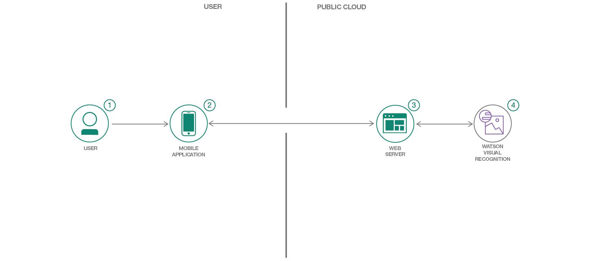

# Create a custom Visual Recognition classifier for minibar usage classification

This is an adaption of the following code pattern :

https://github.com/IBM/watson-vehicle-damage-analyzer

The following steps have been carried out:

* Create a Node.js server that can utilize the Watson Visual Recognition service for classifying images.
* Have a server initialize a Visual Recognition custom classifier at startup.
* Create a Visual Recognition custom classifier in an application.
* Create a phone gap mobile application that can send pictures to a server app for classification using Visual Recognition.

## Flow

1. User interacts with the mobile app and captures an image.
2. The image on the mobile phone is passed to the server application running in the cloud.
3. The server sends the image to Watson Visual Recognition Service for analysis.
4. Visual Recognition service classifies the image and returns the information to the server.

## Included components

* [Watson Visual Recognition](https://www.ibm.com/watson/services/visual-recognition/): Visual Recognition understands the contents of images - tag images, find human faces, approximate age and gender, and find similar images in a collection.

## Featured Technologies

* Mobile: Systems of engagement are increasingly using mobile technology as the platform for delivery.
* [Node.js](https://nodejs.org/): An asynchronous event driven JavaScript runtime, designed to build scalable applications.
